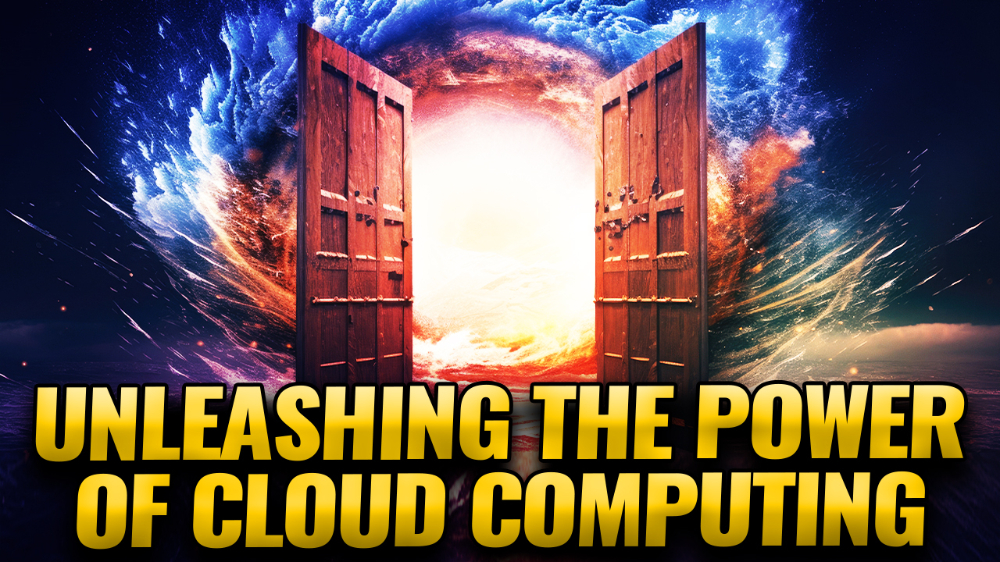

# Azure: Unleashing the Power of Cloud Computing

## Abstract
In today's rapidly evolving digital landscape, organizations leverage the latest technologies to enhance efficiency, scalability, and agility. Microsoft Azure, a leading cloud computing platform, has emerged as a game-changer, offering a comprehensive suite of services that empower businesses to accelerate their digital transformation journeys.

This session aims to provide a comprehensive overview of Azure, highlighting its virtues and diverse services. The session will delve into Azure's essential features, benefits, and capabilities, equipping attendees with the knowledge necessary to harness its full potential.

The session will commence with an introduction to cloud computing and the fundamental concepts underlying Azure. Attendees will gain insights into the cloud's foundational elements, including infrastructure-as-a-service (IaaS), platform-as-a-service (PaaS), and software-as-a-service (SaaS).

Next, the session will dive into the virtues of Azure, emphasizing its robustness, scalability, and high availability. Attendees will discover how Azure provides a secure and compliant foundation for building and managing applications, enabling organizations to focus on innovation rather than infrastructure management.

By the end of this session, attendees will clearly understand Azure's core virtues, its vast array of services, and how it can drive innovation, scalability, and agility within their organizations. With this knowledge, participants will be well-equipped to embark on their cloud adoption journeys with Azure as a powerful enabler.

## Short Abstract
Unlock the Power of Microsoft Azure: Explore its Virtues and Diverse Services for Digital Transformation. Learn essentials & drive innovation!

# Type
* 45/60/75-minute session

## Tags
- Azure
- Cloud
- Cloud Adoption
- Cloud Computing
- Cloud Services
- Compliance
- Digital Transformation
- IaaS (Infrastructure-as-a-Service)
- Microsoft Azure
- PaaS (Platform-as-a-Service)
- SaaS (Software-as-a-Service)
- Scalability
- Security

## Learning Objectives
* Understand the different serverless, event-driven cloud services and how to put them together to build a cohesive microservice-based architecture
* Build a working serverless event-driven microservice-based solution using best practices based upon real-world experience of what has worked and what has not
* Get hands-on experience deploying the solution you have built using continuous integration/continuous development tools that make it easy to keep your solution updated with the latest changes

## Presentations

| Event | Location | Date | Time | Room | Downloads |
|-------|:--------:|-----:|-----:|-----:|----------:|
| [Memphis Azure User Group](https://memphisazure.com/talks/0923) | Memphis, TN (Virtual) | October 2, 2023 | 7:00 pm CDT | Teams | [Slides](/Presentations/UnleashingThePowerOfCloudComputing-Memphis.pdf) | 